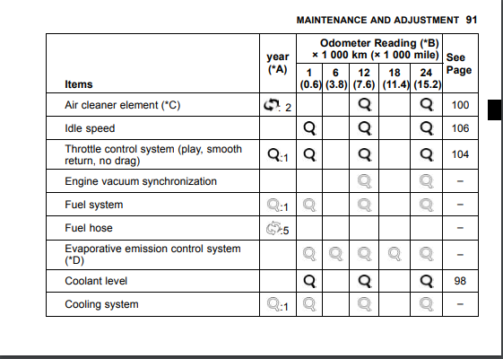

<html>
<head>
<title>Page Title</title>
</head>
<body>

 
<h1>Ninja 300A/B </h1>

<title>Title of the document</title>
   <body>
      <button onclick="window.location.href = 'https://justwill007.github.io/Contact-Form/';">contact</button>
   <body>
      <button onclick="window.location.href = 'https://justwill007.github.io/About-form/';">about</button>

<h2> General Specifications</h2>

<h1 style="border:2px solid black;"></h1>

<h3 style="color:blue;"> Dimensions </h3>

 

<li> Length - 2,015mm (79.33 in.)

<li> Width - 715mm (28.15 in.)

<li> Height - 1,110mm (43.70 in.)

<li> Wheelbase - 1,405mm (55.31 in.)

<li> Clearance - 140mm (5.51 in.)

<li> Seat Height - 785mm (30.91 in.)

<li> Mass [A] 172 Kg (379.3 lb)

<li> Mass [B] 174 Kg (383.7 lb)

<li> 17 L (4.5 US gal.)

<h1 style="border:2px solid black;"></h1>

<h3 style="color:blue;"> Engine </h3>
<li> Type - 4 stroke, DOHC, 2 cylinder

<li> Cooling - liquid cooled

<li> Bore and Stroke - 62.0 x 49.0 mm (2.44 x 1.93 in.)

<li> Displacement - 296 cm³ (18.06 cu in.)

<li> Compression Ratio - 10:6:1

<li> Maximum Horsepower - 29 kW (39 PS) at 11,000 r/min (rpm)

<li> Maximum Torque - 27 N·m (2.8 kgf·m, 20 ft·lb) at 10 000 r/min (rpm)

<li> Carburation System - FI (Fuel Injection) 32 × 2

<li> Starting System - Electric starter

<li> Ignition System - Battery and coil (transistorized)

<li> Timing Advance - Electronically advanced (digital igniter in ECU)

<li> Ignition Timing - From 10° BTDC at 1 300 r/min (rpm)31° BTDC at 7 000 r/min (rpm)

<li> Spark Plug - NGK CR8E

<li> Cylinder Numbering Method - Left to right, 1-2

<li> Firing Order - 1-2

<h1 style="border:2px solid black;"></h1>

<h3 style="color:blue;"> Valve Timing:</h3>
<b> Intake: </b>
<li> Open - 36° BTDC

<li> Close - 56° ABDC

<li> Duration - 272°

<h1 style="border:2px solid black;"></h1>

<h3 style="color:blue;"> Lubrication System </h3>
<b>Engine Oil:</b>

<li> Type - API SG, SH, SJ, SL or SM with JASO MA, MA1 or MA2

<li> Viscosity - SAE 10W-40

<li> Capacity - 2.4 L (2.5r US qt)
<h1 style="border:2px solid black;"></h1>

<h3 style="color:blue;"> Drive Train</h3>

<b> Primary Reduction System</b>

<li> Type - Gear

<li> Reduction Ratio - 3.087 (71/23)

<li> Clutch Type - Wet multi disc

<b> Transmission:</b>
<li> Type - 6-speed, constant mesh, return shift

<b> Gear Ratios:</b>
<li> 1st - 2.714 (38/14)

<li> 2nd - 1.789 (34/19)

<li> 3rd - 1.409 (31/22)

<li> 4th - 1.160 (29/25)

<li> 5th - 1.000 (27/27)

<li> 6th - 0.857 (24/28)

<b> Final Drive System:</b>
<li> Type - Chain drive

<li> Reduction Ratio - 3.000 (42/14)

<li> Overall Drive Ratio - 7.938 at Top gear

<h1 style="border:2px solid black;"></h1>

<h3 style="color:blue;"> Frame</h3>
<li> Type - Tubular, diamond

<li> Caster (Rake Angle) - 27°

<li> Trail - 93mm (3.66 in.)

<b>Front Tire:</b>
<li> Type - Tubeless

<li> Size - 140/70-17M/C 66S

<li> Rim Size - J17M/C × MT4.00

<b> Front Suspension:</b>
<li> Type - Telescopic fork

<li> Wheel Travel - 120mm (4.72 in.)

<b> Rear Suspension:</b>
<li> Type - Swingarm (uni-trak)

<li> Wheel Travel - 132mm (5.20 in.)

<b> Break Type:</b>
<li> Front - Single disc

<li> Rear - Single disc

<h1 style="border:2px solid black;"></h1>

<h3 style="color:blue;"> Electrical Equipment </h3>
<li> battery - 12 V 8 Ah

<b> Headlight:</b>
<li> Type - Semi-Sealed Beam

<b> Bulb:</b>
<li> High - 12 V 55 W (quartz-halogen) x 2

<li> Low - 12 V 55 W (quartz-halogen)

<li> Tail/Break Light 12 V 5/21 W

<b> Alternator:</b>
<li> Type - Three-Phase AC

<li> Rated Output - 21.0 A/14.0 V at 5 000 r/min (rpm)

<h1 style="border:2px solid black;"> </h1>

<h3 style="color:blue"> Service parts and intervals </h3>

 page <b> ❶ </b> 

 page <b> ❷ </b> 

 page <b> ❸ </b> 

 page <b> ❹ </b> 

 page <b> ❺ </b> 

<h1 style="border:2px solid black;"> </h1>
